# Self-Driving Car Engineer Nanodegree

## Deep Learning

## Project: Build a Traffic Sign Recognition Classifier

In this notebook, a template is provided for you to implement your functionality in stages, which is required to successfully complete this project. If additional code is required that cannot be included in the notebook, be sure that the Python code is successfully imported and included in your submission if necessary. 

> **Note**: Once you have completed all of the code implementations, you need to finalize your work by exporting the iPython Notebook as an HTML document. Before exporting the notebook to html, all of the code cells need to have been run so that reviewers can see the final implementation and output. You can then export the notebook by using the menu above and navigating to  \n",
    "**File -> Download as -> HTML (.html)**. Include the finished document along with this notebook as your submission. 

In addition to implementing code, there is a writeup to complete. The writeup should be completed in a separate file, which can be either a markdown file or a pdf document. There is a [write up template](https://github.com/udacity/CarND-Traffic-Sign-Classifier-Project/blob/master/writeup_template.md) that can be used to guide the writing process. Completing the code template and writeup template will cover all of the [rubric points](https://review.udacity.com/#!/rubrics/481/view) for this project.

The [rubric](https://review.udacity.com/#!/rubrics/481/view) contains "Stand Out Suggestions" for enhancing the project beyond the minimum requirements. The stand out suggestions are optional. If you decide to pursue the "stand out suggestions", you can include the code in this Ipython notebook and also discuss the results in the writeup file.


>**Note:** Code and Markdown cells can be executed using the **Shift + Enter** keyboard shortcut. In addition, Markdown cells can be edited by typically double-clicking the cell to enter edit mode.

---
## Step 0: Load The Data


```python
# Load pickled data
import pickle
import numpy as np

#Set the file names
training_file = './traffic-signs-data/train.p'
validation_file= './traffic-signs-data/valid.p'
testing_file = './traffic-signs-data/test.p'

#Load data from the files
with open(training_file, mode='rb') as f:
    train = pickle.load(f)
with open(validation_file, mode='rb') as f:
    valid = pickle.load(f)
with open(testing_file, mode='rb') as f:
    test = pickle.load(f)   

#Load train, validation and test features
X_train, X_train_coords, y_train  = train['features'], train['coords'], train['labels']
X_valid, X_valid_coords,y_valid = valid['features'], valid['coords'], valid['labels']
X_test, X_test_coords, y_test = test['features'], test['coords'], test['labels']

#print data information
print("Shape =", X_train.shape)
print("Type =", X_train.dtype)
print("Mean =", np.mean(X_train))
print("Max =", np.amax(X_train))
print("Min =", np.amin(X_train))
```

    Shape = (34799, 32, 32, 3)
    Type = uint8
    Mean = 82.677589037
    Max = 255
    Min = 0


---

## Step 1: Dataset Summary & Exploration

The pickled data is a dictionary with 4 key/value pairs:

- `'features'` is a 4D array containing raw pixel data of the traffic sign images, (num examples, width, height, channels).
- `'labels'` is a 1D array containing the label/class id of the traffic sign. The file `signnames.csv` contains id -> name mappings for each id.
- `'sizes'` is a list containing tuples, (width, height) representing the original width and height the image.
- `'coords'` is a list containing tuples, (x1, y1, x2, y2) representing coordinates of a bounding box around the sign in the image. **THESE COORDINATES ASSUME THE ORIGINAL IMAGE. THE PICKLED DATA CONTAINS RESIZED VERSIONS (32 by 32) OF THESE IMAGES**

Complete the basic data summary below. Use python, numpy and/or pandas methods to calculate the data summary rather than hard coding the results. For example, the [pandas shape method](http://pandas.pydata.org/pandas-docs/stable/generated/pandas.DataFrame.shape.html) might be useful for calculating some of the summary results. 

### Provide a Basic Summary of the Data Set Using Python, Numpy and/or Pandas


```python
# Number of training examples
n_train = len(X_train)

# Number of validation examples
n_validation = len(X_valid)

# Number of testing examples.
n_test = len(X_test)

# What's the shape of an traffic sign image?
image_shape = X_train.shape

# How many unique classes/labels there are in the dataset.
n_classes = np.amax(y_test) + 1

#Print data information
print("Number of training examples =", n_train)
print("Number of testing examples =", n_test)
print("Image data shape =", image_shape)
print("Number of classes =", n_classes)
```

    Number of training examples = 34799
    Number of testing examples = 12630
    Image data shape = (34799, 32, 32, 3)
    Number of classes = 43


### Include an exploratory visualization of the dataset

Visualize the German Traffic Signs Dataset using the pickled file(s). This is open ended, suggestions include: plotting traffic sign images, plotting the count of each sign, etc. 

The [Matplotlib](http://matplotlib.org/) [examples](http://matplotlib.org/examples/index.html) and [gallery](http://matplotlib.org/gallery.html) pages are a great resource for doing visualizations in Python.

**NOTE:** It's recommended you start with something simple first. If you wish to do more, come back to it after you've completed the rest of the sections. It can be interesting to look at the distribution of classes in the training, validation and test set. Is the distribution the same? Are there more examples of some classes than others?


```python
### Data exploration visualization code goes here.
import matplotlib.pyplot as plt
from random import randrange

# Visualizations will be shown in the notebook.
%matplotlib inline

#Utility function to print imges on the same line
def printImages(Images, Index, cmap='RdGy_r'):
    
    n_images = len(Index)
    
    #create the image array
    f, axarr = plt.subplots(1, n_images, figsize=(32, 32))
    
    for i in range(n_images):
        if(len(Images)>Index[i]):
            axarr[i].imshow(Images[Index[i]], cmap = cmap)
        else:
            axarr[i].imshow(np.zeros((32,32,3), dtype='uint8'))
        axarr[i].title.set_text(str(Index[i]))
    plt.show()

# Create an array to store one image per class
classes = np.zeros((n_classes+1, 32, 32, 3), dtype='uint8')

#Get one sample image for every class
for im, imClass in zip(X_train, y_train):
    if np.array_equal(classes[imClass], np.zeros((32,32,3))):
        classes[imClass] = np.copy(im)
        #TODO: set break
        
#Print classes
print('Classes Sample images: ')
imagesPerLine = 8
for i in range(0,n_classes+1,imagesPerLine):
    printImages(classes, range(i,i+imagesPerLine)) 

```

    Classes Sample images: 


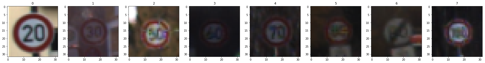


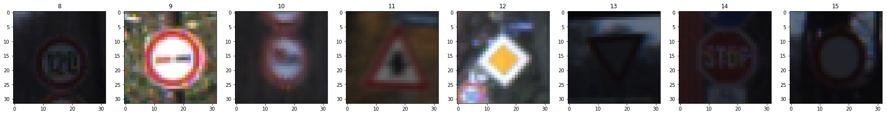


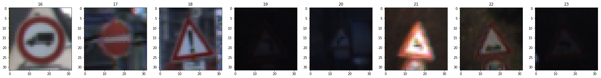


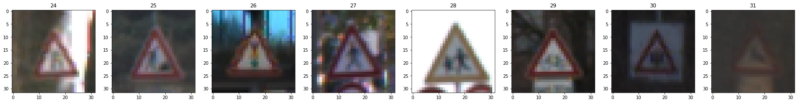


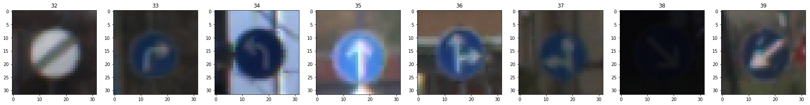


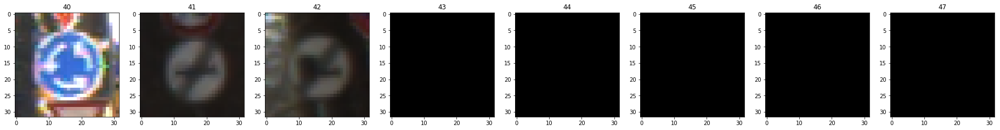


```python
#Print distribution of the training data
fig, (ax0) = plt.subplots(ncols=1, figsize=(8, 4))

dist = ax0.hist(y_train, range(n_classes+1), normed=0, histtype='bar', facecolor='g')
ax0.set_title('Classes distribution')     

distMean = np.mean(dist[0])
distDev = np.std(dist[0])

print("Distribution mean = {}".format(distMean) )
print("Std dev = {}".format(distDev) )
print("Min = {}".format(np.amin(dist[0]) ))
print("Max = {}".format(np.amax(dist[0]) ))

fig.tight_layout()
plt.show()
```

    Distribution mean = 809.2790697674419
    Std dev = 619.4201837045108
    Min = 180.0
    Max = 2010.0


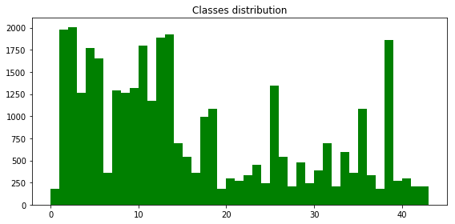


----

## Step 2: Design and Test a Model Architecture

Design and implement a deep learning model that learns to recognize traffic signs. Train and test your model on the [German Traffic Sign Dataset](http://benchmark.ini.rub.de/?section=gtsrb&subsection=dataset).

The LeNet-5 implementation shown in the [classroom](https://classroom.udacity.com/nanodegrees/nd013/parts/fbf77062-5703-404e-b60c-95b78b2f3f9e/modules/6df7ae49-c61c-4bb2-a23e-6527e69209ec/lessons/601ae704-1035-4287-8b11-e2c2716217ad/concepts/d4aca031-508f-4e0b-b493-e7b706120f81) at the end of the CNN lesson is a solid starting point. You'll have to change the number of classes and possibly the preprocessing, but aside from that it's plug and play! 

With the LeNet-5 solution from the lecture, you should expect a validation set accuracy of about 0.89. To meet specifications, the validation set accuracy will need to be at least 0.93. It is possible to get an even higher accuracy, but 0.93 is the minimum for a successful project submission. 

There are various aspects to consider when thinking about this problem:

- Neural network architecture (is the network over or underfitting?)
- Play around preprocessing techniques (normalization, rgb to grayscale, etc)
- Number of examples per label (some have more than others).
- Generate fake data.

Here is an example of a [published baseline model on this problem](http://yann.lecun.com/exdb/publis/pdf/sermanet-ijcnn-11.pdf). It's not required to be familiar with the approach used in the paper but, it's good practice to try to read papers like these.

### Pre-process the Data Set 

Minimally, the image data should be normalized so that the data has mean zero and equal variance. For image data, `(pixel - 128)/ 128` is a quick way to approximately normalize the data and can be used in this project. 

Other pre-processing steps are optional. You can try different techniques to see if it improves performance. 

Use the code cell (or multiple code cells, if necessary) to implement the first step of your project.

#### Convert to grey scale


```python
import cv2

#utility function that convert the features in grey scale
def greyImage(features, h_pxl = 32, w_pxl = 32):
    grey = [cv2.cvtColor(im, cv2.COLOR_BGR2GRAY) for im in features]
    return np.array(grey).reshape((len(features), h_pxl, w_pxl, 1))

#Convert training, validation and test features in grey scale
X_train_gray = greyImage(X_train)
X_valid_gray = greyImage(X_valid)
X_test_gray = greyImage(X_test)

#Print data information
print("X_train=", X_train.shape)
print("X_train_gray =", X_train_gray.shape)

```

    X_train= (34799, 32, 32, 3)
    X_train_gray = (34799, 32, 32, 1)


#### Data normalization: Grey scale images


```python
X_train_gray_norm = (128 - X_train_gray.astype(float))/128
X_valid_gray_norm = (128 - X_valid_gray.astype(float))/128
X_test_gray_norm = (128 - X_test_gray.astype(float))/128

print("X_train_gray_norm =", X_train_gray_norm.shape)
print("Mean =", np.mean(X_train_gray_norm))
print("Max =", np.amax(X_train_gray_norm))
print("Min =", np.amin(X_train_gray_norm))

print('\nGray norm scale images: ')
# create a list of random index to display images
displayIndex = [randrange(0, len(X_train_gray_norm), 1) for _ in range(10)]
printImages(X_train_gray_norm.reshape((len(X_train_gray_norm),32,32)), displayIndex, 'gray')

displayIndex = [randrange(0, len(X_train_gray_norm), 1) for _ in range(10)]
printImages(X_train_gray_norm.reshape((len(X_train_gray_norm),32,32)), displayIndex, 'gray')
```

    X_train_gray_norm = (34799, 32, 32, 1)
    Mean = 0.367058775261
    Max = 0.9765625
    Min = -0.9921875
    
    Gray norm scale images: 


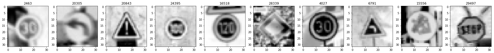


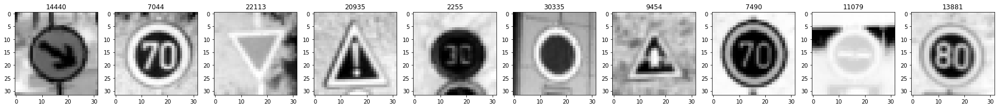


#### Data normalization: color images


```python
X_train_norm = (128 - X_train.astype(float))/128
X_valid_norm = (128 - X_valid.astype(float))/128
X_test_norm = (128 - X_test.astype(float))/128

print("Mean =", np.mean(X_train_norm))
print("Max =", np.amax(X_train_norm))
print("Min =", np.amin(X_train_norm))
print("Shape =", X_train_norm.shape)

print('\nColor norm images: ')
# create a list of random index to display images
displayIndex = [randrange(0, len(X_train_norm), 1) for _ in range(10)]
printImages(X_train_norm, displayIndex)

displayIndex = [randrange(0, len(X_train_norm), 1) for _ in range(10)]
printImages(X_train_norm, displayIndex)
```

    Mean = 0.354081335648
    Max = 1.0
    Min = -0.9921875
    Shape = (34799, 32, 32, 3)
    
    Color norm images: 


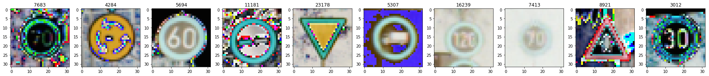


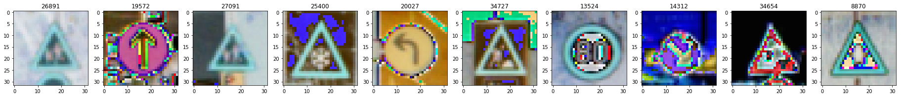


### Data Augmentation: Processing Image with keras

#### Data transformation definition

For the data transformation KERAS package is used.
Some useful links to understand how it works:
- http://machinelearningmastery.com/image-augmentation-deep-learning-keras/
- https://keras.io/preprocessing/image/


```python
from keras.preprocessing.image import ImageDataGenerator
```

    Using TensorFlow backend.


```python
def ApplyTrans(X_train_in, y_train_in):


    # configure batch size and retrieve one batch of images
    for X_batch, y_batch in datagen.flow(X_train_in.astype('float32'), 
                                         y_train_in, 
                                         batch_size = int(X_train_in.shape[0]), 
                                         shuffle = False):

        X_train_out = X_batch.astype('uint8')
        y_train_out = y_batch
        
        #the loop is infinite, break at first
        break

    #return the transformed images
    return X_train_out, y_train_out
```

The transformation to be apply is:
- Rotation angle range of 5 degrees
- Shear range of 0.1 rad

Such as small variations were chossen due the fact that the orignial data set has a low resoution: 32x32. From experimentation if higher values are set, the output data could loss its shape until the point to reduce the accuracy in training phase.


```python
# define data preparation
datagen = ImageDataGenerator(rotation_range= 5,
                             shear_range = 0.1)
# fit parameters from data
datagen.fit(X_train.astype('float32'))
```

#### Data augmentation and balance

The training data is highly unbalance between classes. In order to balance the data,a data augmentation strategy is applied to increase the number of data to those classes with small  number of samples.


```python
from sklearn.utils import shuffle

#Initializes the augmentation data features with the orignial ones.
X_train_plus = X_train
y_train_plus = y_train

#This factor determines how big will be the new data set.
#Each class will be increas as close as possible to factor*max
#Where max is the number of samples of the class with the highest number of samples
#In this case the class with highest number of samples is 2 with almost 2000 samples.
#The expect dimentison of the new data set is (factor = 1)*2000*43 = 86000 +/- error
factor = 1

#For all the classes
for cl in range(n_classes):
    
    #Extract all the members of the class cl
    tupl = [(xi, yi) for xi,yi in zip(X_train,y_train) if yi == cl]
    
    #convert the features in np.array
    X_train_in = np.array([x for (x,y) in tupl])
    y_train_in = np.array([y for (x,y) in tupl])
    
    #print progress
    print("{} ".format(cl), end = "")
    
    #Calculate the number of iterations to arrive to the same number of the class with highest number of samples
    #The step is the number of samples with the class of least samples.
    incr = int(np.amin(dist[0]))
    n_iter = int((np.amax(dist[0])*factor - dist[0][cl])/incr)
    
    for e in range(n_iter):
        
        #Shuffle
        X_train_in, y_train_in = shuffle(X_train_in, y_train_in)
        
        #Get the sub-samples to apply the transformation
        X_train_in = X_train_in[0:incr] 
        y_train_in = y_train_in[0:incr] 
        
        #Apply the transformation
        X_train_in, y_train_in = ApplyTrans(X_train_in, y_train_in)
        
        #Concatenate the new features with the previous one (Original + trasnformed)
        X_train_plus = np.concatenate((X_train_plus, X_train_in))
        y_train_plus = np.concatenate((y_train_plus, y_train_in))
```

    0 1 2 3 4 5 6 7 8 9 10 11 12 13 14 15 16 17 18 19 20 21 22 23 24 25 26 27 28 29 30 31 32 33 34 35 36 37 38 39 40 41 42 


```python
print('\nTrasnformation images: ')

displayIndex = [randrange(len(X_train), len(X_train_plus), 1) for _ in range(10)]
printImages(X_train_plus, displayIndex)

print('\nClass images: ')
displayIndex = [y_train_plus[i].astype('uint8') for i in displayIndex]
printImages(classes, displayIndex)

print('\nTrasnformation images: ')
displayIndex = [randrange(len(X_train), len(X_train_plus), 1) for _ in range(10)]
printImages(X_train_plus.astype('uint8'), displayIndex)

print('\nClass images: ')
displayIndex = [y_train_plus[i] for i in displayIndex]
printImages(classes, displayIndex)

```

    
    Trasnformation images: 


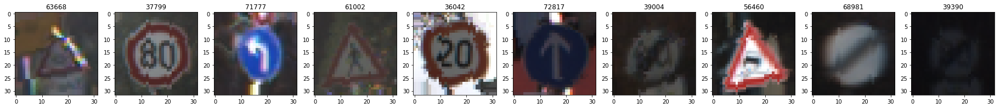


    
    Class images: 


![png]Traffic_Sign_Classifier/(output_29_3.png)


    
    Trasnformation images: 


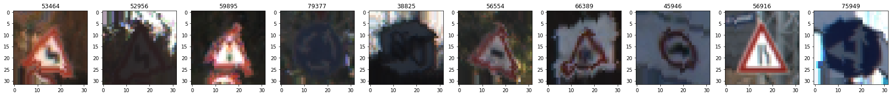


    
    Class images: 


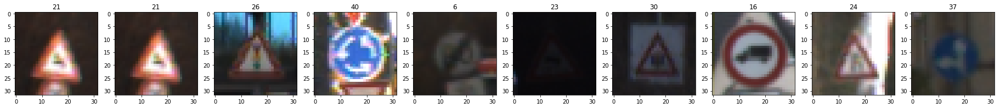


```python
print("Number of training samples: {}".format(len(y_train_plus)))

print("Shape =", X_train_plus.shape)
print("Type =", X_train_plus.dtype)
print("Mean =", np.mean(X_train_plus))
print("Max =", np.amax(X_train_plus))
print("Min =", np.amin(X_train_plus))

#Print distribution of the training data
fig, (ax0) = plt.subplots(ncols=1, figsize=(8, 4))

dist_plus = ax0.hist(y_train_plus, range(n_classes+1), normed=0, histtype='bar', facecolor='g', alpha=0.75)
ax0.set_title('Classes distribution')

distMean_plus = np.mean(dist_plus[0])
distDev_plus = np.std(dist_plus[0])             
                       
print("\nDistribution mean = {}".format(distMean_plus) )
print("Std dev = {}".format(distDev_plus) )
print("Min = {}".format(np.amin(dist_plus[0]) ))
print("Max = {}".format(np.amax(dist_plus[0]) ))          
                       
                       
fig.tight_layout()
plt.show()
```

    Number of training samples: 83759
    Shape = (83759, 32, 32, 3)
    Type = uint8
    Mean = 83.8339978375
    Max = 255
    Min = 0
    
    Distribution mean = 1947.8837209302326
    Std dev = 50.73607463999958
    Min = 1859.0
    Max = 2010.0


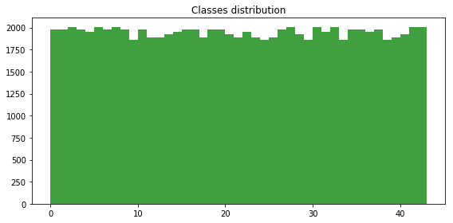


```python
print("Mean =", np.mean(X_train_plus))
print("Max =", np.amax(X_train_plus))
print("Min =", np.amin(X_train_plus))
print("type =", X_train_plus.dtype)
```

    Mean = 83.8339978375
    Max = 255
    Min = 0
    type = uint8


```python
X_train_plus = (128 - X_train_plus.astype(float))/128

print("Mean =", np.mean(X_train_plus))
print("Max =", np.amax(X_train_plus))
print("Min =", np.amin(X_train_plus))
```

    Mean = 0.345046891895
    Max = 1.0
    Min = -0.9921875


### Model Architecture

### Train, Validate and Test the Model

A validation set can be used to assess how well the model is performing. A low accuracy on the training and validation
sets imply underfitting. A high accuracy on the training set but low accuracy on the validation set implies overfitting.


```python
import tensorflow as tf
```

#### Place holder defintion


```python
#Set the place holder for the neural network
x = tf.placeholder(tf.float32, (None, 32, 32, 3))
y = tf.placeholder(tf.int32, (None))
one_hot_y = tf.one_hot(y, n_classes)
kb_conv_1 = tf.placeholder("float")
kb_conv_2 = tf.placeholder("float")
kb_fc_1 = tf.placeholder("float")
kb_fc_2 = tf.placeholder("float")
```

#### Initial parameter defintion

A data dictionaty was defined with all the parameters of the model. Defining the parameters outside the model implementation allow us to change them easly without modifing the implementation itself. Besides that the model is also independant to the input data. 


```python
#Set the parameters for the neural network
par = {
    'ch': 3,               #Image channel numbers
    'sigma': 0.1,          #Sigma for weights initialization 
    'mu': 0,               #Mean for weights initialization
    'batchSize' : 128,     #Batch size
    'epochs' : 20,         #Numnber of epochs
    'rate' : 0.0001,       #Learning rate
    'beta' : 0.01,         #Regularization parameter
    'earlyTermEn' : 1,     #Early termination enable
    'kb_conv_1' : 1.0,     #Keep probabilities for elements
    'kb_conv_2' : 1.0,     #Keep probabilities for elements
    'kb_fc_1' : 0.6,       #Keep probabilities for elements
    'kb_fc_2' : 0.6,       #Keep probabilities for elements
    'name' : "TestName"    #Experiment name
}

#As initial value to the inputs set the raw values
X_train_in = X_train
y_train_in = y_train
X_valid_in = X_valid
y_valid_in = y_valid
X_test_in  = X_test
y_test_in  = y_test
```


```python
#utility function to print the paramters of the network
def printInfo():
    print("NAME: {}".format(par['name']))
    for x in par:
        if(par[x] != 'name'):
            print("{} = {}".format(x, par[x]))
```

#### LeNet design

From the first LeNet implementation the major changes implements to the Neural network was the adding of the droout between layers and incrementing the convolution deep as well as incremeting the W in the fully connected layers.

Initially the dropout was introduced without any modification to the LeNet dimmensions, but the result was poor and in some cases the accuracy was lower than the obtained with the initial LeNet. Afterwardm the deepness was increment by the double and even if there was improvment in the accuracy the result did not reached the target: <93%. Therfore the deepness was increment considerably to 128 for the convolutional layers and 1024 for the fully connected layers. It is possible that with lower values the samne result could be reached decrementing at the same time the training time and memory and resource usage.

At this point the Kb were tunned and the ideal point was found with high values (<80%) for the convulational layers and middle values (=60%) of the fully connected layers. A more detail analisys about the tunning experimentation is below this section.

 - kb_conv_1   = 0.9
 - kb_conv_2   = 0.8   
 - kb_fc_1     = 0.6      
 - kb_fc_2     = 0.6  

Inline with this order of ideas a possible improvement of the network could be incrementing the dimensions of the convolutional layers (high and width) using a different filter or applying a padding and afterward decrementing the values of kb_conv_1 and kb_conv_2.

| Layer  | Node     | Desgin        | Out Shape     | Filter size      |     
| :----: | :------: | :-----------: | :-----------: | :-----------:    |
| 1      | 1.1      | Conv1         | 28 x 28 x 128 | 5 x 5 x 3 x 128  |
|        | 1.2      | Relu          | 28 x 28 x 128 |                  |
|        | 1.3      | Pooling       | 14 x 14 x 128 | 2 x 2            |
|        | 1.4      | Dropout       | 14 x 14 x 128 |                  |
| 2      | 2.1      | Conv2         | 10 x 10 x 128 | 5 x 5 x 128 x 128|
|        | 2.2      | Relu          | 10 x 10 x 128 |                  |
|        | 2.3      | Pooling       |  5 x  5 x 128 |  2 x 2           |
|        | 2.4      | Dropout       |  5 x  5 x 128 |  5 x  5 x 128    |
| 3      | 3.1      | flatten       | 3200          |                  |
|        | 3.1      | Fully Connect | 1024          | 3200 x 1024      |
|        | 3.2      | Relu          | 1024          |                  |
|        | 3.3      | Dropout       | 1024          |                  |
| 4      | 4.1      | Fully Connect | 43            | 1024 x 43        |
|        | 4.1      | Relu          | 43            |                  |
|        | 4.1      | Dropout       | 43            |                  |


```python
from tensorflow.contrib.layers import flatten


def LeNet7():    
    # Arguments used for tf.truncated_normal, randomly defines variables for the weights and biases for each layer
    mu = par['mu']
    sigma = par['sigma']
    ch = par['ch']
    
    # Layer 1: Convolutional. Input = 32x32xch. Output = 28x28x128
    conv1_W = tf.Variable(tf.truncated_normal(shape=(5, 5, ch, 128), mean = mu, stddev = sigma))
    conv1_b = tf.Variable(tf.zeros(128))
    conv1   = tf.nn.conv2d(x, conv1_W, strides=[1, 1, 1, 1], padding='VALID') + conv1_b

    # Activation.
    conv1 = tf.nn.relu(conv1)

    # Pooling. Input = 28x28x128. Output = 14x14x128.
    conv1 = tf.nn.max_pool(conv1, ksize=[1, 2, 2, 1], strides=[1, 2, 2, 1], padding='VALID')
    
    #Dropout
    conv1  = tf.nn.dropout(conv1, kb_conv_1)

    # Layer 2: Convolutional. Output = 10x10x128.
    conv2_W = tf.Variable(tf.truncated_normal(shape=(5, 5, 128, 128), mean = mu, stddev = sigma))
    conv2_b = tf.Variable(tf.zeros(128))
    conv2   = tf.nn.conv2d(conv1, conv2_W, strides=[1, 1, 1, 1], padding='VALID') + conv2_b
    
    # Activation.
    conv2 = tf.nn.relu(conv2)

    # Pooling. Input = 10x10x128. Output = 5x5x128.
    conv2 = tf.nn.max_pool(conv2, ksize=[1, 2, 2, 1], strides=[1, 2, 2, 1], padding='VALID')
    
    #Dropout
    conv2  = tf.nn.dropout(conv2, kb_conv_2)

    # Flatten. Input = 5x5x128. Output = 3200.
    fc0   = flatten(conv2)
    
    # Layer 3: Fully Connected. Input = 3200. Output = 1024.
    fc1_W = tf.Variable(tf.truncated_normal(shape=(3200, 1024), mean = mu, stddev = sigma))
    fc1_b = tf.Variable(tf.zeros(1024))
    fc1   = tf.matmul(fc0, fc1_W) + fc1_b
      
    # Activation.
    fc1    = tf.nn.relu(fc1)
    fc1    = tf.nn.dropout(fc1, kb_fc_1)

    # Layer 4: Fully Connected. Input = 1024. Output = 1024.
    fc2_W  = tf.Variable(tf.truncated_normal(shape=(1024, 1024), mean = mu, stddev = sigma))
    fc2_b  = tf.Variable(tf.zeros(1024))
    fc2    = tf.matmul(fc1, fc2_W) + fc2_b
    
    # Activation.
    fc2    = tf.nn.relu(fc2)
    fc2    = tf.nn.dropout(fc2, kb_fc_2)

    # Layer 5: Fully Connected. Input = 1024. Output = 43.
    fc3_W  = tf.Variable(tf.truncated_normal(shape=(1024, n_classes), mean = mu, stddev = sigma))
    fc3_b  = tf.Variable(tf.zeros(n_classes))
    logits = tf.matmul(fc2, fc3_W) + fc3_b
    
    return logits, [conv1_W, conv2_W, fc1_W, fc2_W, fc3_W]
```

#### Evaluate and test

In these sections define the evaluation and test functions. Note that while the evaluation function has input parameters due to the fact that is used for the validation and test phases, the test is used always the test data stets.
It is important to set the Kb of the dropout layers to *1.0* in order to not loss information during the test and/or validation phase.


```python
def evaluate(X_data, y_data):
    #Load parameters
    batchSize = par['batchSize']
    
    #build of evaluation pipeline: Mean of comparision Logits with Labels.
    correct_prediction = tf.equal(tf.argmax(logits, 1), tf.argmax(one_hot_y, 1))
    accuracy_operation = tf.reduce_mean(tf.cast(correct_prediction, tf.float32))
    
    #Initializes variables
    num_examples = len(X_data)
    total_accuracy = 0
    
    #Get the session
    sess = tf.get_default_session()
    
    #Check accuracy for batch
    for offset in range(0, num_examples, batchSize):
        
        #Divide the validation data by batch
        batch_x, batch_y = X_data[offset:offset+batchSize], y_data[offset:offset+batchSize]
        
        #Feed the dictionary (need to run logits). Dropout Kb parameters set to 1.0 to not loss data
        feed_dict={x: batch_x, y: batch_y, kb_conv_1:1.0, kb_conv_2:1.0, kb_fc_1:1.0, kb_fc_2:1.0}
        #Run the graph
        accuracy = sess.run(accuracy_operation, feed_dict)
        #weight the accuracy for the batch size (not need if the num_elem is a multiple of batch size)
        total_accuracy += (accuracy * len(batch_x))
    
    #Return the total accuracy
    return total_accuracy / num_examples
```


```python
def testAccuracy():
    #Load paramters
    name = par['name']
    batchSize = par['batchSize']
    
    #Initializes the saver to load the graph variables (weigths)
    saver = tf.train.Saver()
    
    with tf.Session() as sess:
        #Restore variables from file
        saver.restore(sess, './weights/' + name +'.ckpt')
        
        #Calculate the accuracy of the test data
        test_accuracy = evaluate(X_test_in, y_test_in)
        print("Test Accuracy " + name + " = {:.3f}".format(test_accuracy))
        
        return test_accuracy

```

#### Definition of the training pipeline with regularization

The function *l2_loss(t)* caculates the L2 norm of a tensor and it is used to calculate the regularizer.
 - *output = sum(t ** 2) / 2*


```python
#Support function to calculate the regularizer = 1/2 * ||W||;
def L2Norm(weights):
    L2NormTot = 0
    for w in weights:
        L2NormTot += tf.nn.l2_loss(w)
    return L2NormTot
```

The new loss equiaton with normalization is:
\begin{equation*}
L'   = L'  + \beta\frac{1}{2}\sum{w_i^2}
\end{equation*}

Using the support funciton defined abovem the training pipeline is defined as follow:


```python
def defineTrainingPipeline(LeNetFunc):
    
    rate = par['rate']
    Beta = par['beta']
    
    #Define the LeNet
    logits, weights = LeNetFunc()
    
    #Use cross entropty to calculate the lodd
    cross_entropy = tf.nn.softmax_cross_entropy_with_logits(labels=one_hot_y, logits=logits)
    loss_operation = tf.reduce_mean(cross_entropy)
    
    #Normalize the loss
    regularizer = L2Norm(weights)
    loss_operation = loss_operation + Beta*regularizer
    
    #Define the optimizer
    optimizer = tf.train.AdamOptimizer(learning_rate = rate)
    trainOp = optimizer.minimize(loss_operation)
    
    return logits, trainOp
```

#### Definiton of the Training function

The training funciton was implement as the one expose in the course module and its feed with the hyper parameters defined in the dictionary. One enhance of the module is the implementation of the early termination, however this code was disable during the experiments to see the complete evolution of the trainning process.


```python

def training():
    #Load paramters
    name          = par['name']
    kb_conv_1_val = par['kb_conv_1']
    kb_conv_2_val = par['kb_conv_2']
    kb_fc_1_val   = par['kb_fc_1']
    kb_fc_2_val   = par['kb_fc_2']
    earlyTermEn   = par['earlyTermEn']
    EPOCHS        = par['epochs']
    batchSize     = par['batchSize']
    
    
    #initializes the saver for save the variables
    saver = tf.train.Saver()
    
    with tf.Session() as sess:
        #Initializes gloabal varaibles (place holders)
        sess.run(tf.global_variables_initializer())
        
        #Initializes internal variables
        num_examples = len(X_train)
        validation_accuracy = []
        validation_accuracy_max = 0
        
        print('')
        
        #Train the neural network 
        for i in range(EPOCHS):
            
            #Shuffle the train data
            X_train_sh, y_train_sh = shuffle(X_train_in, y_train_in)
            
            #Train the neural network with batches
            for offset in range(0, num_examples, batchSize):
                
                #Divided the neural network in batches
                end = offset + batchSize
                batch_x, batch_y = X_train_sh[offset:end], y_train_sh[offset:end]
                
                #Feed the dictionary with the parameters
                feed_dict={x: batch_x, 
                           y: batch_y, 
                           kb_conv_1: kb_conv_1_val, 
                           kb_conv_2: kb_conv_2_val, 
                           kb_fc_1: kb_fc_1_val, 
                           kb_fc_2: kb_fc_2_val}
                
                #Run the graph
                sess.run(trainOp, feed_dict)
                
            #At the end of each iteration save the accuracy
            validation_accuracy.append(evaluate(X_valid_in, y_valid_in))
            
            #Print the infromation after each iteration (epoch)
            print("[{0:2}, {1:.3f}], ".format(i+1, validation_accuracy[i]), end="")
            if ((i+1)%5) is 0:
                print()
            
            
            #Early termination
            earlyTermination = 0
            #Execute only if early termination is enalbed
            if(earlyTermEn is 1):
                #Check if the current accuracy is higher than the maximum
                if(validation_accuracy_max < validation_accuracy[i]):
                    #Save the data when a maimum is reach
                    validation_accuracy_max = validation_accuracy[i]
                    saver.save(sess, './weights/' + name +'.ckpt')
                    earlyTermination = i
                    if(i > 0):
                        #If the accuracy is less than 2% of the max: stop traiing
                        if((validation_accuracy[i] + 0.02) < validation_accuracy_max):
                            break
            else:
                #If early termination is not enabled, save always each epoch
                #TODO: Save only at the end if the early termination is not enabled
                saver.save(sess, './weights/' + name +'.ckpt')
                
        #At the end of the training print information
        print()
        print("Max accuracy in epoch: " + str(earlyTermination+1))
        
        #return accuracy by epoch
        return validation_accuracy
```

#### Traning Color Normalized enhanced data


```python
X_train_in = X_train_plus
y_train_in = y_train_plus

X_valid_in = X_valid_norm
X_test_in  = X_test_norm

par['name']        = "ColorNormRegDropPlus_1"
par['epochs']      = 20
par['rate']        = 0.0005
par['kb_conv_1']   = 0.9 
par['kb_conv_2']   = 0.8   
par['kb_fc_1']     = 0.6      
par['kb_fc_2']     = 0.6  
par['beta']        = 0.001
par['earlyTermEn'] = 0
par['ch']          = 3


#printInfo()

logits, trainOp = defineTrainingPipeline(LeNet7)

ColorNormRegDropPlus_1 = training()

TestColorNormRegDropPlus_1 = testAccuracy()
```

    
    [ 1, 0.129], [ 2, 0.515], [ 3, 0.775], [ 4, 0.868], [ 5, 0.896], 
    [ 6, 0.912], [ 7, 0.922], [ 8, 0.939], [ 9, 0.920], [10, 0.936], 
    [11, 0.946], [12, 0.950], [13, 0.952], [14, 0.957], [15, 0.951], 
    [16, 0.955], [17, 0.940], [18, 0.949], [19, 0.959], [20, 0.964], 
    
    Max accuracy in epoch: 1
    Test Accuracy ColorNormRegDropPlus_1 = 0.945


#### Traning Color Normalized data


```python
X_train_in = X_train_norm
y_train_in = y_train

X_valid_in = X_valid_norm
X_test_in  = X_test_norm

par['name']        = "ColorNormRegDrop_1"
par['epochs']      = 20
par['rate']        = 0.0005
par['kb_conv_1']   = 0.9 
par['kb_conv_2']   = 0.8   
par['kb_fc_1']     = 0.6      
par['kb_fc_2']     = 0.6  
par['beta']        = 0.001
par['earlyTermEn'] = 0
par['ch']          = 3

#printInfo()

logits, trainOp = defineTrainingPipeline(LeNet7)

colorNorm0001_1 = training()

TestcolorNorm0001_1 = testAccuracy()
```

    
    [ 1, 0.254], [ 2, 0.622], [ 3, 0.851], [ 4, 0.898], [ 5, 0.928], 
    [ 6, 0.939], [ 7, 0.947], [ 8, 0.961], [ 9, 0.957], [10, 0.961], 
    [11, 0.952], [12, 0.962], [13, 0.956], [14, 0.955], [15, 0.955], 
    [16, 0.956], [17, 0.965], [18, 0.966], [19, 0.967], [20, 0.955], 
    
    Max accuracy in epoch: 1
    Test Accuracy ColorNormRegDrop_1 = 0.957


#### Traning Gray Normalized data


```python
X_train_in = X_train_gray_norm
y_train_in = y_train

X_valid_in = X_valid_gray_norm
X_test_in  = X_test_gray_norm

x = tf.placeholder(tf.float32, (None, 32, 32, 1))

par['name']        = "GrayNormRegDrop_1"
par['epochs']      = 20
par['rate']        = 0.0005
par['kb_conv_1']   = 0.9 
par['kb_conv_2']   = 0.8   
par['kb_fc_1']     = 0.6      
par['kb_fc_2']     = 0.6  
par['beta']        = 0.001
par['earlyTermEn'] = 0
par['ch']          = 1

#printInfo()

logits, trainOp = defineTrainingPipeline(LeNet7)

GrayNormRegDrop_1 = training()

TestGrayNormRegDrop_1 = testAccuracy()
```

    
    [ 1, 0.419], [ 2, 0.754], [ 3, 0.873], [ 4, 0.913], [ 5, 0.919], 
    [ 6, 0.938], [ 7, 0.939], [ 8, 0.941], [ 9, 0.932], [10, 0.948], 
    [11, 0.946], [12, 0.960], [13, 0.953], [14, 0.960], [15, 0.948], 
    [16, 0.961], [17, 0.950], [18, 0.944], [19, 0.958], [20, 0.946], 
    
    Max accuracy in epoch: 1
    Test Accuracy GrayNormRegDrop_1 = 0.947


#### Comparison between trainings

A comparision between the type of data input is present below. As it could be noticed there is not a considerable difference between the enhanced and not enahced data, and at the same time between color and gray data. At this point it is possible to used only gray data for the training and analysis as it will reduce the training and resourse compsuption. However all the experiments were done with color data and such a conclusion should be validated and tested.

#### Comparison between trainings


```python
fig, ax = plt.subplots(1,1,figsize=(20, 15))

Label = 'Color Norm Data plus'
epochResult = ColorNormRegDropPlus_1
AccuracyResult = TestColorNormRegDropPlus_1

size = len(epochResult)
TestAccuracy = [ AccuracyResult for i in range(size)]

line1, = ax.plot(range(0, size) , epochResult,  label=Label, alpha=0.5)
line1, = ax.plot(range(0, size) , TestAccuracy, label='Accuracy ' + Label)

Label = 'Color Norm Data'
epochResult = colorNorm0001_1
AccuracyResult = TestcolorNorm0001_1

size = len(epochResult)
TestAccuracy = [ AccuracyResult for i in range(size)]

line1, = ax.plot(range(0, size) , epochResult,  label=Label, alpha=0.5)
line1, = ax.plot(range(0, size) , TestAccuracy, label='Accuracy ' + Label)

Label = 'Gray Norm Data'
epochResult = GrayNormRegDrop_1
AccuracyResult = TestGrayNormRegDrop_1

size = len(epochResult)
TestAccuracy = [ AccuracyResult for i in range(size)]

line1, = ax.plot(range(0, size) , epochResult,  label=Label, alpha=0.5)
line1, = ax.plot(range(0, size) , TestAccuracy, label='Accuracy ' + Label)

ax.grid(True, which='both')
ax.yaxis.set_ticks([i/20.0 for i in range(1,20)])
ax.legend(loc='best', fancybox=True, framealpha=0.5)
ax.set_xlabel('Epochs')
ax.set_ylabel('Accuracy')


```


    <matplotlib.text.Text at 0x7fc6b0b92748>


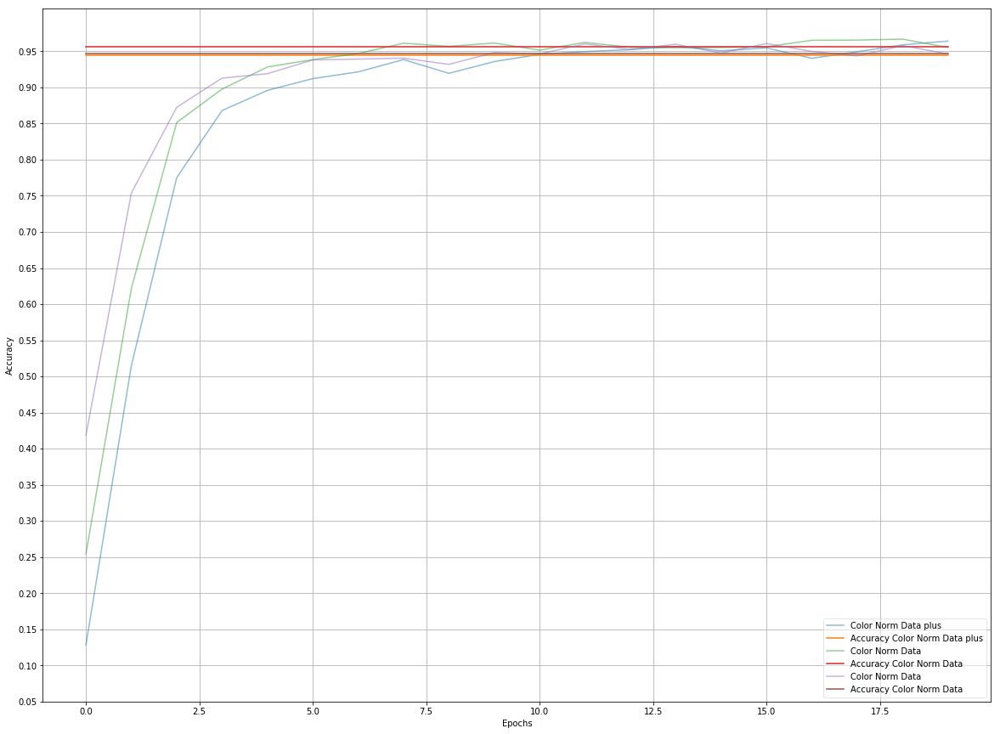


### Oher experiments

#### Dropout dependency

During the experimentation with the LetNet function and its desing. The strategy that have more impact improving the accuracy was adding dropout tensors in between layers. Following there are some experiments with the different values of the Kb. The Test_1 simulate a LeNet without dropout.

Other important fact to consider is that the test acuracy could change drastically running the same experiment several times. A error of around 1.5% should be considered to the final result.


```python
X_train_in = X_train_plus
y_train_in = y_train_plus

X_valid_in = X_valid_norm
X_test_in  = X_test_norm

par['name']        = "Test_1"
par['kb_conv_1']   = 1.0 
par['kb_conv_2']   = 1.0   
par['kb_fc_1']     = 1.0      
par['kb_fc_2']     = 1.0  
par['beta']        = 0.001
par['ch']          = 3

x = tf.placeholder(tf.float32, (None, 32, 32, 3))

logits, trainOp = defineTrainingPipeline(LeNet7)
Exp_1 = training()
Test_1 = testAccuracy()
```

    
    [ 1, 0.527], [ 2, 0.609], [ 3, 0.690], [ 4, 0.720], [ 5, 0.732], 
    [ 6, 0.738], [ 7, 0.752], [ 8, 0.777], [ 9, 0.775], [10, 0.779], 
    [11, 0.796], [12, 0.793], [13, 0.808], [14, 0.806], [15, 0.810], 
    [16, 0.815], [17, 0.815], [18, 0.830], [19, 0.826], [20, 0.835], 
    
    Max accuracy in epoch: 20
    Test Accuracy Test_1 = 0.855


```python
par['name']        = "Test_2"
par['kb_conv_1']   = 0.5 
par['kb_conv_2']   = 0.5   
par['kb_fc_1']     = 1.0      
par['kb_fc_2']     = 1.0  

logits, trainOp = defineTrainingPipeline(LeNet7)
Exp_2 = training()
Test_2 = testAccuracy()
```

    
    [ 1, 0.059], [ 2, 0.039], [ 3, 0.036], [ 4, 0.050], [ 5, 0.075], 
    [ 6, 0.102], [ 7, 0.137], [ 8, 0.201], [ 9, 0.298], [10, 0.428], 
    [11, 0.540], [12, 0.593], [13, 0.653], [14, 0.700], [15, 0.749], 
    [16, 0.793], [17, 0.808], [18, 0.810], [19, 0.839], [20, 0.849], 
    
    Max accuracy in epoch: 20
    Test Accuracy Test_2 = 0.832


```python
par['name']        = "Test_3"
par['kb_conv_1']   = 1.0 
par['kb_conv_2']   = 1.0   
par['kb_fc_1']     = 0.7      
par['kb_fc_2']     = 0.7  

logits, trainOp = defineTrainingPipeline(LeNet7)
Exp_3 = training()
Test_3 = testAccuracy()
```

    
    [ 1, 0.248], [ 2, 0.441], [ 3, 0.583], [ 4, 0.672], [ 5, 0.741], 
    [ 6, 0.780], [ 7, 0.803], [ 8, 0.827], [ 9, 0.844], [10, 0.844], 
    [11, 0.855], [12, 0.868], [13, 0.867], [14, 0.878], [15, 0.888], 
    [16, 0.883], [17, 0.886], [18, 0.892], [19, 0.895], [20, 0.901], 
    
    Max accuracy in epoch: 20
    Test Accuracy Test_3 = 0.903


```python
par['name']        = "Test_4"
par['kb_conv_1']   = 1.0 
par['kb_conv_2']   = 1.0   
par['kb_fc_1']     = 0.5      
par['kb_fc_2']     = 0.5  

logits, trainOp = defineTrainingPipeline(LeNet7)
Exp_4 = training()
Test_4 = testAccuracy()
```

    
    [ 1, 0.105], [ 2, 0.119], [ 3, 0.169], [ 4, 0.284], [ 5, 0.431], 
    [ 6, 0.592], [ 7, 0.717], [ 8, 0.783], [ 9, 0.793], [10, 0.810], 
    [11, 0.833], [12, 0.853], [13, 0.881], [14, 0.885], [15, 0.877], 
    [16, 0.897], [17, 0.907], [18, 0.914], [19, 0.913], [20, 0.923], 
    
    Max accuracy in epoch: 20
    Test Accuracy Test_4 = 0.921


```python
fig, ax = plt.subplots(1,1,figsize=(20, 15))

def plotSetup(Label, epochResult, AccuracyResult):

    size = len(epochResult)
    TestAccuracy = [ AccuracyResult for i in range(size)]

    line1, = ax.plot(range(0, size) , epochResult,  label=Label, alpha=0.4)
    line1, = ax.plot(range(0, size) , TestAccuracy, label='Accuracy ' + Label)

plotSetup('Test_1', Exp_1, Test_1)
plotSetup('Test_2', Exp_2, Test_2)
plotSetup('Test_3', Exp_3, Test_3)
plotSetup('Test_4', Exp_4, Test_4)

ax.grid(True, which='both')
ax.yaxis.set_ticks([i/20.0 for i in range(1,20)])
ax.legend(loc='best', fancybox=True, framealpha=0.5)
ax.set_xlabel('Epochs')
ax.set_ylabel('Accuracy')
```


    <matplotlib.text.Text at 0x7f893251cdd8>


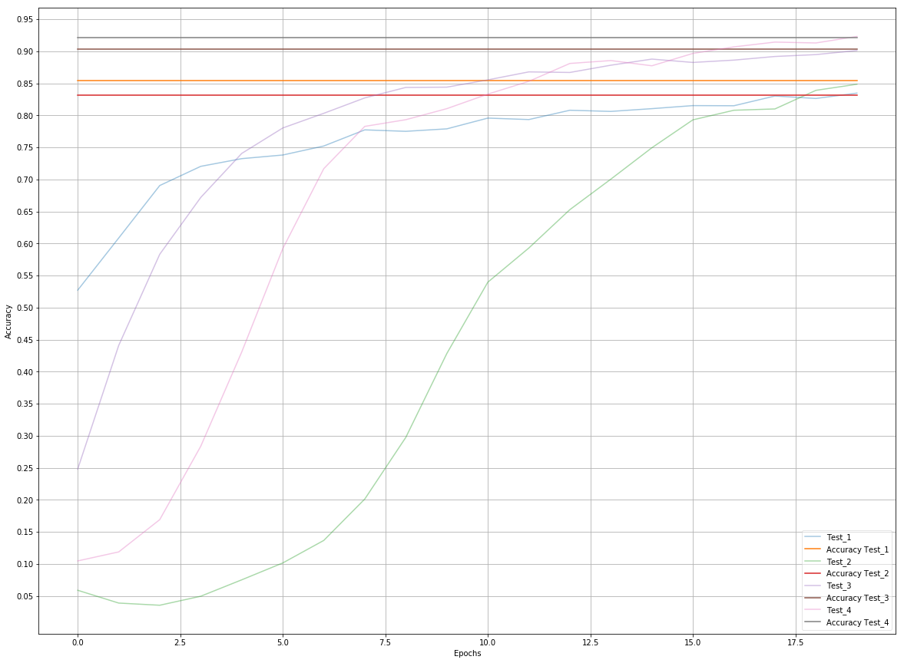


#### Regularization dependency

During the experimentation with the training pipeline, the regularization did not have "considerable" impact in improving the model accuracy. Following there are some experiments that highlight the regularization impact.


```python
par['name']        = "Test_5"
par['kb_conv_1']   = 1.0 
par['kb_conv_2']   = 1.0   
par['kb_fc_1']     = 1.0      
par['kb_fc_2']     = 1.0  
par['beta']        = 0.1

logits, trainOp = defineTrainingPipeline(LeNet7)
Exp_5 = training()
Test_5 = testAccuracy()
```

    
    [ 1, 0.463], [ 2, 0.584], [ 3, 0.655], [ 4, 0.708], [ 5, 0.734], 
    [ 6, 0.734], [ 7, 0.729], [ 8, 0.709], [ 9, 0.729], [10, 0.660], 
    [11, 0.700], [12, 0.698], [13, 0.666], [14, 0.644], [15, 0.679], 
    [16, 0.661], [17, 0.655], [18, 0.652], [19, 0.646], [20, 0.595], 
    
    Max accuracy in epoch: 1
    Test Accuracy Test_5 = 0.732


```python
par['name']        = "Test_6"
par['kb_conv_1']   = 1.0 
par['kb_conv_2']   = 1.0   
par['kb_fc_1']     = 1.0      
par['kb_fc_2']     = 1.0  
par['beta']        = 0.01

logits, trainOp = defineTrainingPipeline(LeNet7)
Exp_6 = training()
Test_6 = testAccuracy()
```

    
    [ 1, 0.534], [ 2, 0.641], [ 3, 0.704], [ 4, 0.755], [ 5, 0.785], 
    [ 6, 0.799], [ 7, 0.785], [ 8, 0.804], [ 9, 0.825], [10, 0.830], 
    [11, 0.810], [12, 0.862], [13, 0.839], [14, 0.849], [15, 0.887], 
    [16, 0.852], [17, 0.875], [18, 0.887], [19, 0.874], [20, 0.885], 
    
    Max accuracy in epoch: 1
    Test Accuracy Test_6 = 0.870


```python
par['name']        = "Test_7"
par['kb_conv_1']   = 1.0 
par['kb_conv_2']   = 1.0   
par['kb_fc_1']     = 1.0      
par['kb_fc_2']     = 1.0  
par['beta']        = 0.005

logits, trainOp = defineTrainingPipeline(LeNet7)
Exp_7 = training()
Test_7 = testAccuracy()
```

    
    [ 1, 0.509], [ 2, 0.639], [ 3, 0.665], [ 4, 0.729], [ 5, 0.743], 
    [ 6, 0.766], [ 7, 0.802], [ 8, 0.793], [ 9, 0.815], [10, 0.813], 
    [11, 0.808], [12, 0.822], [13, 0.822], [14, 0.841], [15, 0.818], 
    [16, 0.854], [17, 0.869], [18, 0.855], [19, 0.868], [20, 0.876], 
    
    Max accuracy in epoch: 20
    Test Accuracy Test_7 = 0.881


```python
par['name']        = "Test_10"
par['kb_conv_1']   = 1.0 
par['kb_conv_2']   = 1.0   
par['kb_fc_1']     = 1.0      
par['kb_fc_2']     = 1.0  
par['beta']        = 0.0

logits, trainOp = defineTrainingPipeline(LeNet7)
Exp_10 = training()
Test_10 = testAccuracy()
```

    
    [ 1, 0.532], [ 2, 0.666], [ 3, 0.708], [ 4, 0.733], [ 5, 0.758], 
    [ 6, 0.774], [ 7, 0.763], [ 8, 0.788], [ 9, 0.793], [10, 0.790], 
    [11, 0.808], [12, 0.815], [13, 0.810], [14, 0.824], [15, 0.825], 
    [16, 0.821], [17, 0.819], [18, 0.823], [19, 0.831], [20, 0.829], 
    
    Max accuracy in epoch: 1
    Test Accuracy Test_10 = 0.846


```python
fig, ax = plt.subplots(1,1,figsize=(20, 10))

def plotSetup(Label, epochResult, AccuracyResult):

    size = len(epochResult)
    TestAccuracy = [ AccuracyResult for i in range(size)]

    line1, = ax.plot(range(0, size) , epochResult,  label=Label)
    line1, = ax.plot(range(0, size) , TestAccuracy, label='Accuracy ' + Label, alpha=0.5)

plotSetup('Test_1', Exp_1, Test_1)
plotSetup('Test_5', Exp_5, Test_5)
plotSetup('Test_6', Exp_6, Test_6)
plotSetup('Test_7', Exp_7, Test_7)
plotSetup('Test_10', Exp_10, Test_10)

ax.grid(True, which='both')
ax.yaxis.set_ticks([i/20.0 for i in range(1,20)])
ax.legend(loc='best', fancybox=True, framealpha=0.5)
ax.set_xlabel('Epochs')
ax.set_ylabel('Accuracy')
```


    <matplotlib.text.Text at 0x7f892fe67198>


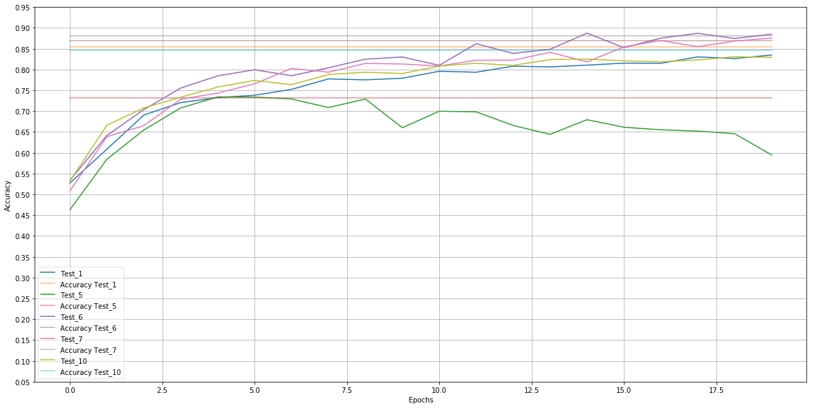


#### Learning rate dependency

In the following experiments its highlight the impact of the high learning rate.


```python
par['name']        = "Test_8"
par['kb_conv_1']   = 1.0 
par['kb_conv_2']   = 1.0   
par['kb_fc_1']     = 1.0      
par['kb_fc_2']     = 1.0  
par['beta']        = 0.001
par['rate']        = 0.001


logits, trainOp = defineTrainingPipeline(LeNet7)
Exp_8 = training()
Test_8 = testAccuracy()
```

    
    [ 1, 0.812], [ 2, 0.853], [ 3, 0.866], [ 4, 0.880], [ 5, 0.918], 
    [ 6, 0.922], [ 7, 0.911], [ 8, 0.920], [ 9, 0.922], [10, 0.936], 
    [11, 0.921], [12, 0.937], [13, 0.935], [14, 0.933], [15, 0.926], 
    [16, 0.937], [17, 0.936], [18, 0.949], [19, 0.942], [20, 0.946], 
    
    Max accuracy in epoch: 1
    Test Accuracy Test_8 = 0.932


```python
par['name']        = "Test_9"
par['kb_conv_1']   = 1.0 
par['kb_conv_2']   = 1.0   
par['kb_fc_1']     = 1.0      
par['kb_fc_2']     = 1.0  
par['rate']        = 0.01


logits, trainOp = defineTrainingPipeline(LeNet7)
Exp_9 = training()
Test_9 = testAccuracy()
```

    
    [ 1, 0.014], [ 2, 0.007], [ 3, 0.007], [ 4, 0.007], [ 5, 0.034], 
    [ 6, 0.007], [ 7, 0.048], [ 8, 0.027], [ 9, 0.034], [10, 0.048], 
    [11, 0.034], [12, 0.014], [13, 0.054], [14, 0.020], [15, 0.048], 
    [16, 0.007], [17, 0.054], [18, 0.048], [19, 0.007], [20, 0.034], 
    
    Max accuracy in epoch: 1
    Test Accuracy Test_9 = 0.059


```python
fig, ax = plt.subplots(1,1,figsize=(20, 10))

def plotSetup(Label, epochResult, AccuracyResult):

    size = len(epochResult)
    TestAccuracy = [ AccuracyResult for i in range(size)]

    line1, = ax.plot(range(0, size) , epochResult,  label=Label)
    line1, = ax.plot(range(0, size) , TestAccuracy, label='Accuracy ' + Label, alpha=0.5)

plotSetup('Test_1', Exp_1, Test_1)
plotSetup('Test_8', Exp_8, Test_8)
plotSetup('Test_9', Exp_9, Test_9)

ax.grid(True, which='both')
ax.yaxis.set_ticks([i/20.0 for i in range(1,20)])
ax.legend(loc='best', fancybox=True, framealpha=0.5)
ax.set_xlabel('Epochs')
ax.set_ylabel('Accuracy')
```


    <matplotlib.text.Text at 0x7f892e2cea58>


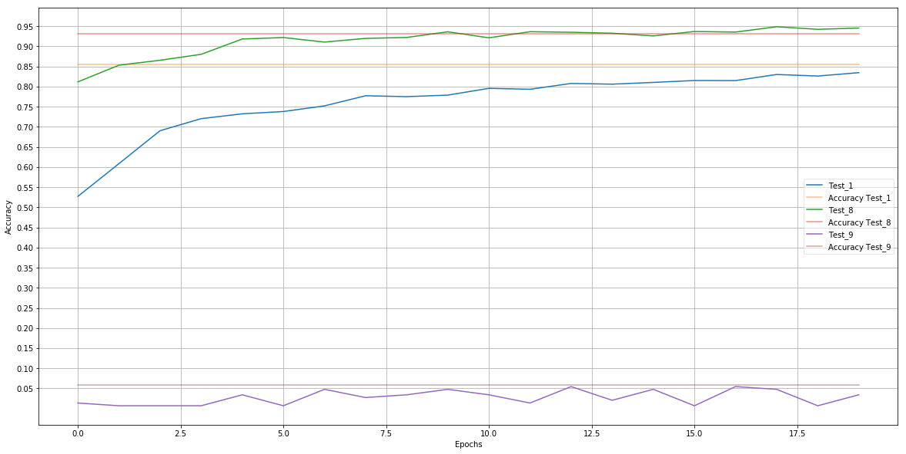


---

## Step 3: Test a Model on New Images

To give yourself more insight into how your model is working, download at least five pictures of German traffic signs from the web and use your model to predict the traffic sign type.

You may find `signnames.csv` useful as it contains mappings from the class id (integer) to the actual sign name.

### Load and Output the Images


```python
import os
import matplotlib.image as mpimg

directory = "TestImages/"

ImageFiles = os.listdir(directory)
X_images = []
y_images = []
for file in ImageFiles:
    X_images.append(mpimg.imread(directory + file))
    y_images.append(int(file.split('.')[0]))
    
 
X_images = [np.array(im).reshape(32,32,3) for im in X_images]

X_images = np.array(X_images)
y_images = np.array(y_images)

print("Image data shape =", X_images.shape)
print("Classes data shape =", y_images.shape)

print("Clases: ", y_images)
index = [x for x in range(5)]
printImages(X_images, index)
```

    Image data shape = (5, 32, 32, 3)
    Classes data shape = (5,)
    Clases:  [14 25  2 17 11]
    


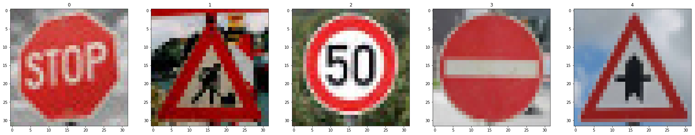


### Predict the Sign Type for Each Image

The resolution, constrast and shape definition of the new test images are higher compare with the ones used for training and test the neural network.

What is expected are excellent results identifying "stop" (class 14 ) and "no entry" (class 17) due to the fact that their shapes and colors are the most clear and sharpest ones even with low resolution images. 

Lower results are expected in the classification of speed limitation (Class 2) due to the fact that already in the train data set the low resolution makes, even for the human eye,  distinguish the limit (30, 50, etc).

The lowest accuracy is expected in the warning signal (triangle with a shape inside: class 25 and 11) due the figure inside of the signal is completely "destroyed" during the transformation and moreover because already in the orignal images are completely blurred. In particular the image correspoing to the class 25 has a lot of rumor. 


```python
### Run the predictions here and use the model to output the prediction for each image.

#Chosse the training session from where to load the variables
name = "ColorNormRegDropPlus_1"

#Redefine the optimal paramters
par['epochs']      = 20
par['rate']        = 0.0005
par['kb_conv_1']   = 0.9 
par['kb_conv_2']   = 0.8   
par['kb_fc_1']     = 0.6      
par['kb_fc_2']     = 0.6  
par['beta']        = 0.001
par['earlyTermEn'] = 0
par['ch']          = 3

#Set the input data
X_train_in = (128 - X_images.astype(float))/128
y_train_in = y_images

# Remove the previous weights and bias
tf.reset_default_graph()

#Set the place holder for the neural network
x = tf.placeholder(tf.float32, (None, 32, 32, 3))
y = tf.placeholder(tf.int32, (None))

kb_conv_1 = tf.placeholder("float")
kb_conv_2 = tf.placeholder("float")
kb_fc_1 = tf.placeholder("float")
kb_fc_2 = tf.placeholder("float")

#Define the pipeline
logits, w = LeNet7()
soft = tf.nn.softmax(logits)
top = tf.nn.top_k(soft, k=5)


# Class used to save and/or restore Tensor Variables
saver = tf.train.Saver()

with tf.Session() as sess:
    
    # Load the weights and bias
    saver.restore(sess, './weights/' + name +'.ckpt')
    
    feed_dict={x: X_train_in, 
               y: y_train_in, 
               kb_conv_1:1.0, 
               kb_conv_2:1.0, 
               kb_fc_1:1.0, 
               kb_fc_2:1.0}
    
    #Run the graphs
    out1 = sess.run(logits, feed_dict)
    out2 = sess.run(soft, feed_dict)
    out3 = sess.run(top, feed_dict)
```

### Analyze Performance


```python
### Calculate the accuracy for these 5 new images. 
### For example, if the model predicted 1 out of 5 signs correctly, it's 20% accurate on these new images.

comp = [1 for xi,yi in zip(y_images, out3.indices[:,0]) if (xi == yi) ]

print("Model Accuracy = ", np.sum(comp)/5)
```

    Model Accuracy =  0.6
    

The accuracy on the captured images is 0.945% while it was 0.6% on the testing set thus It seems the model is overfitting

### Output Top 5 Softmax Probabilities For Each Image Found on the Web

For each of the new images, print out the model's softmax probabilities to show the **certainty** of the model's predictions (limit the output to the top 5 probabilities for each image). [`tf.nn.top_k`](https://www.tensorflow.org/versions/r0.12/api_docs/python/nn.html#top_k) could prove helpful here. 


```python
### Print out the top five softmax probabilities for the predictions on the German traffic sign images found on the web. 
```


```python
# Show the values of weights and bias

# For all the 5 test images:
for i in range(5):
    plt.rcdefaults()
    fig, ax = plt.subplots(1, 2, figsize=(20, 3))
    
    #Print Images
    ax[0].imshow(X_images[i])
    ax[0].title.set_text("Class: " + str(y_images[i]))
    
    #Print softmax function per image
    y_pos = np.arange(len(y_images))
    ax[1].barh(y_pos, out3.values[i,:], color='green', ecolor='black')
    labels = []
    labels.append('') #workaround: the first element is not visulaized
    labels = labels + out3.indices[i,:].tolist()
    ax[1].set_yticklabels(labels)
    ax[1].invert_yaxis()  # labels read top-to-bottom
    
    plt.show()

```


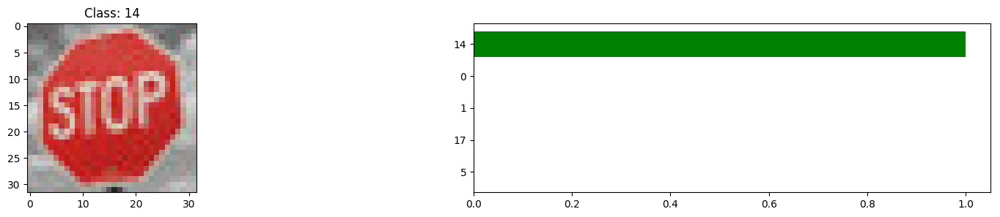


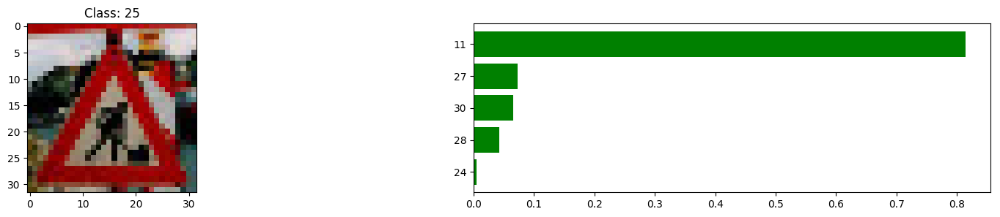


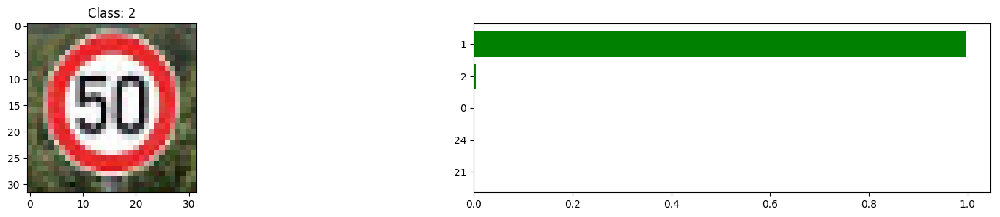


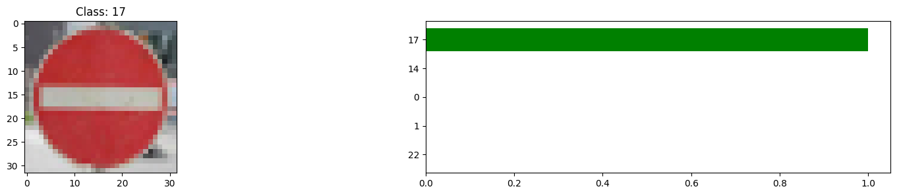


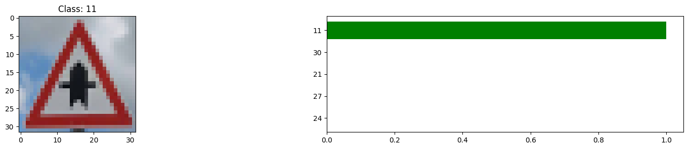


#### Images predicted


```python
print('\nOriginal images ')
index = [x for x in range(5)]
printImages(X_images, index)
print('\nClasses predicted ')
printImages(classes, out3.indices[:,0])
printImages(classes, out3.indices[:,1])
printImages(classes, out3.indices[:,2])
printImages(classes, out3.indices[:,3])
printImages(classes, out3.indices[:,4])
```

    
    Original images 


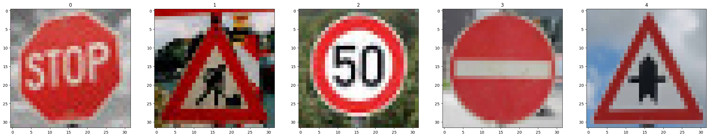


    
    Classes predicted 


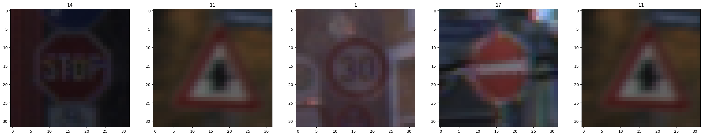


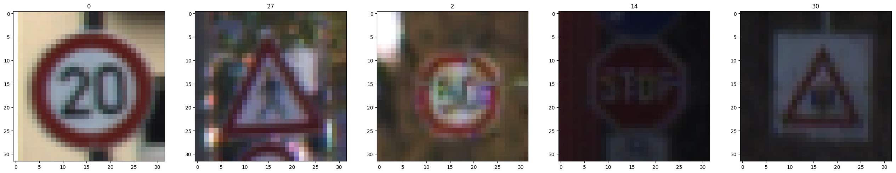


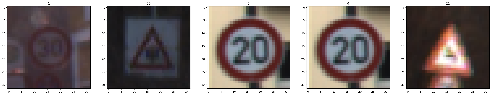


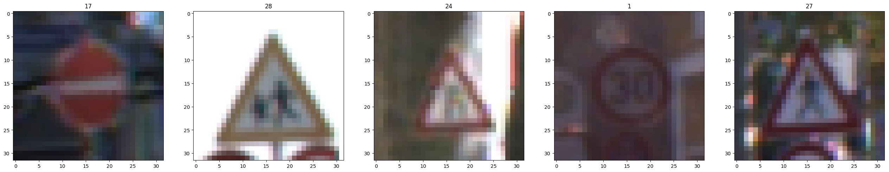


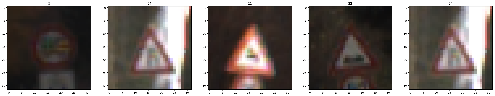


It seems how the circles and triangle forms are well predicted. By the other hand the shapes inside the forms could have a large margin of uncertitude. In particular of the class 25 ("Road work") is not classified in the first 5 images.

#### TODO and improvements:
- The test and validation data set are also unbalance. It could be interesting test and validate the model using a balanced data set or modify the "evaluate" function to weight the accuracy according to the class distribution.
- Perform expeerimentation with other techniques of validation: cross validaiton.
- Experiment with other types of optimizers.
- Experiment with different optimizers


```python

```
